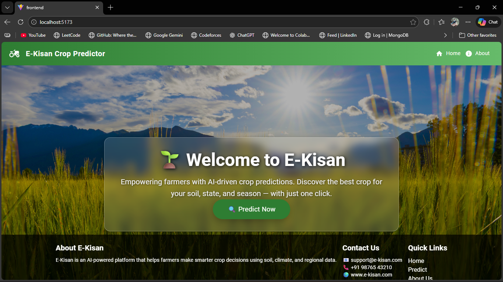
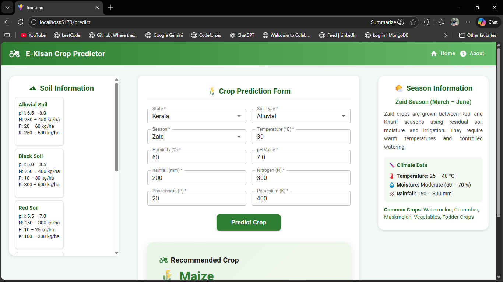
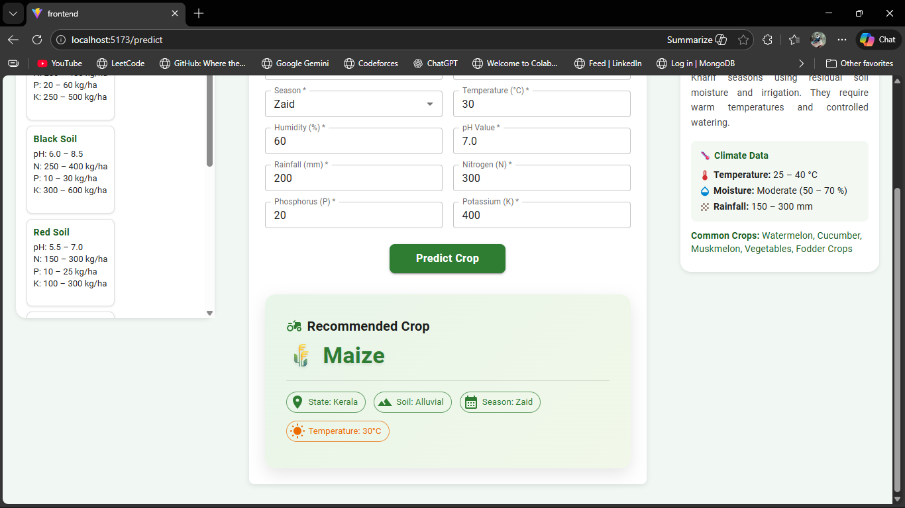
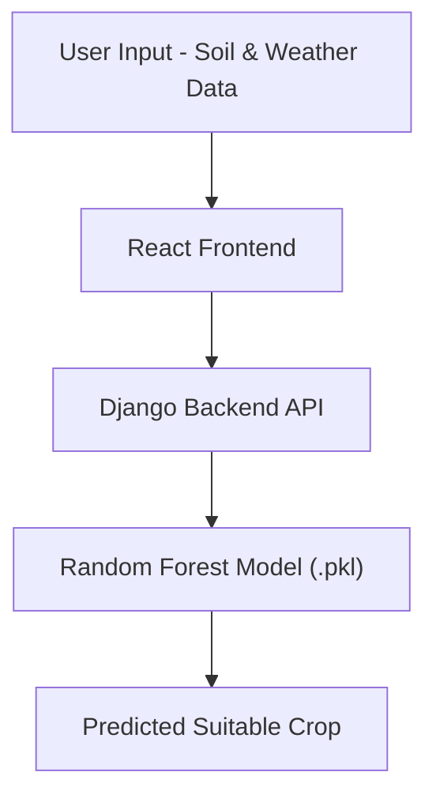

# 🌾 E-Kisan-A Crop Prediction System

E-Kisan-A is a smart agriculture web application that predicts the most suitable crop based on soil nutrients and environmental conditions.  
The system leverages Machine Learning to enable data-driven, sustainable farming decisions and improve agricultural productivity.

---

## 📸 Demo

### 🏠 Home Page



---

### 📝 Crop Prediction Form



---

### 🌾 Prediction Result



---

## 🚀 Features

- Crop prediction based on:
  - Nitrogen (N)
  - Phosphorus (P)
  - Potassium (K)
  - Soil pH
  - Temperature
  - Humidity
  - Rainfall
- Machine Learning-based prediction engine
- REST API integration
- Interactive and user-friendly frontend
- Real-time prediction results
- Scalable backend architecture

---

## 🧠 Machine Learning Model

- **Algorithm Used:** Random Forest Classifier (scikit-learn)
- **Model Type:** Supervised Multi-Class Classification
- **Model Serialization:** Pickle (`.pkl`)
- **Input Features:** Soil nutrients and weather parameters
- **Output:** Recommended crop type

The model was trained using structured agricultural datasets with preprocessing and feature engineering to optimize prediction accuracy.

---

## 🏗 System Architecture



---

## 🛠 Tech Stack

### Backend
- Python  
- Django  
- scikit-learn  
- Pickle  

### Frontend
- React.js  
- HTML / CSS / JavaScript  

### Database
- SQLite / PostgreSQL  

---

## 📦 Installation

### 1️⃣ Clone the Repository

```bash
git clone https://github.com/yourusername/e-kisan.git
cd e-kisan
```
---
