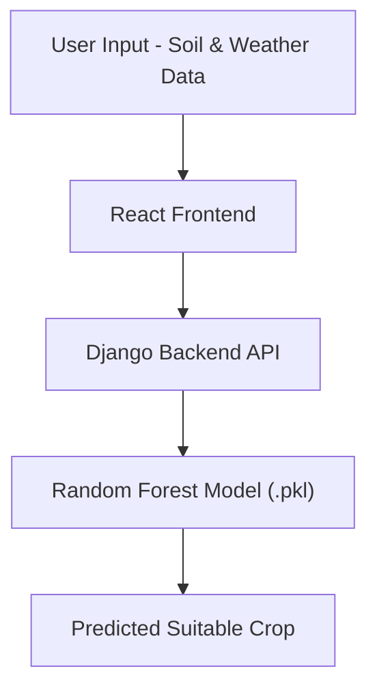

# 🌾 E-Kisan-A Crop Prediction System

E-Kisan-A is a smart agriculture web application that predicts the most suitable crop based on soil nutrients and environmental conditions.  
The system leverages Machine Learning to enable data-driven, sustainable farming decisions and improve agricultural productivity.

---

## 📸 Demo

### 🏠 Home Page


---

### 📝 Crop Prediction Form


---

### 🌾 Prediction Result


---

## 🚀 Features

- Crop prediction based on:
  - Nitrogen (N)
  - Phosphorus (P)
  - Potassium (K)
  - Soil pH
  - Temperature
  - Humidity
  - Rainfall
- Machine Learning-based prediction engine
- REST API integration
- Interactive and user-friendly frontend
- Real-time prediction results
- Scalable backend architecture

---

## 🧠 Machine Learning Model

- **Algorithm Used:** Random Forest Classifier (scikit-learn)
- **Model Type:** Supervised Multi-Class Classification
- **Model Serialization:** Pickle (`.pkl`)
- **Input Features:** Soil nutrients and weather parameters
- **Output:** Recommended crop type

The model was trained using structured agricultural datasets with preprocessing and feature engineering to optimize prediction accuracy.

---

## 🏗 System Architecture



---

## 🛠 Tech Stack

### Backend
- Python  
- Django  
- scikit-learn  
- Pickle  

### Frontend
- React.js  
- HTML / CSS / JavaScript  

### Database
- SQLite / PostgreSQL  

---

## 📦 Installation

### 1️⃣ Clone the Repository

```bash
git clone https://github.com/yourusername/e-kisan.git
cd e-kisan
```
---
## 2️⃣ Backend Setup (Django)

```bash
pip install -r requirements.txt
python manage.py migrate
python manage.py runserver
```
---
### 3️⃣ Frontend Setup (React)
```bash
cd frontend
npm install
npm start
```
---
## ▶️ How It Works

1. User enters soil nutrient and environmental parameters.
2. Data is sent to the Django backend via REST API.
3. The Random Forest model processes the input features.
4. The system predicts the most suitable crop.
5. The result is displayed on the React interface.

---

## 📊 Applications

- Precision Agriculture  
- Sustainable Farming  
- Yield Optimization  
- Resource Management  
- Agricultural Advisory Systems  

---

## 🔮 Future Enhancements

- Integration with real-time weather APIs  
- Fertilizer recommendation system  
- Crop yield prediction module  
- Mobile application version  
- Cloud deployment (AWS / Azure)  
